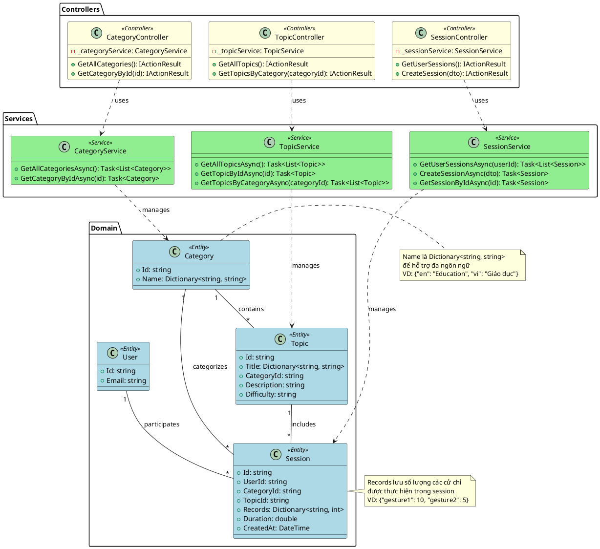

# GestPipe Application - Class Diagram Guide
# Hướng dẫn vẽ Class Diagram cho ứng dụng GestPipe

## Tổng quan (Overview)

Ứng dụng GestPipe là một hệ thống quản lý cử chỉ (gesture management) với kiến trúc Backend API (ASP.NET Core) và Desktop Application (WPF). Hệ thống sử dụng MongoDB làm cơ sở dữ liệu và tuân theo mô hình kiến trúc MVC/Service Layer.

## Các thành phần chính (Main Components)

### 1. Domain Models (Các lớp thực thể)

#### 1.1 User Management (Quản lý người dùng)

**User**
- **Thuộc tính (Attributes):**
  - `Id: string` - MongoDB ObjectId
  - `Email: string`
  - `PasswordHash: string`
  - `AccountStatus: string` - Trạng thái tài khoản (inactive, activeonline, activeoffline, pending, blocked)
  - `GestureRequestStatus: string`
  - `UiLanguage: string?`
  - `AvatarUrl: string`
  - `RequestCountToday: int`
  - `CreatedAt: DateTime`
  - `LastLogin: DateTime?`
  - `VersionGestureId: string?` - Reference to version gesture
  - `AuthProvider: string?` - Provider đăng nhập (Google)
  - `ProviderId: string?`
  - `EmailVerified: bool`

**UserProfile**
- **Quan hệ:** 1-1 với User (thông qua UserId)
- **Thuộc tính:**
  - `Id: string`
  - `UserId: string` - Foreign key to User
  - `FullName: string?`
  - `UpdatedAt: DateTime?`
  - `Occupation: string?` - Nghề nghiệp
  - `Company: string?`
  - `BirthDate: DateTime?`
  - `EducationLevel: string?` - Trình độ học vấn
  - `PhoneNumber: string?`
  - `Gender: string?`
  - `Address: string?`

**Otp**
- **Thuộc tính:**
  - `Email: string` - Primary key
  - `OtpCode: string`
  - `Purpose: string` - Mục đích (registration, resetpassword)
  - `CreatedAt: DateTime`
  - `ExpiresAt: DateTime`
  - `AttemptsCount: int`
- **Phương thức:**
  - `IsExpired(): bool`

#### 1.2 Gesture Management (Quản lý cử chỉ)

**GestureType**
- **Thuộc tính:**
  - `Id: string`
  - `TypeName: Dictionary<string, string>` - Tên đa ngôn ngữ {"en": "...", "vi": "..."}
  - `Code: Dictionary<string, string>` - Mã đa ngôn ngữ

**DefaultGesture**
- **Quan hệ:** 
  - Nhiều-1 với GestureType (thông qua GestureTypeId)
  - Nhúng VectorData
- **Thuộc tính:**
  - `Id: string`
  - `VersionId: string` - Phiên bản cử chỉ
  - `GestureTypeId: string` - Foreign key to GestureType
  - `PoseLabel: string` - Nhãn tư thế
  - `Status: Dictionary<string, string>` - Trạng thái đa ngôn ngữ
  - `Accuracy: double` - Độ chính xác
  - `CreatedAt: DateTime`
  - `VectorData: VectorData` - Dữ liệu vector nhúng

**UserGestureConfig**
- **Quan hệ:**
  - Nhiều-1 với User (thông qua UserId)
  - Nhiều-1 với GestureType (thông qua GestureTypeId)
  - Nhúng VectorData
- **Thuộc tính:**
  - `Id: string`
  - `UserId: string` - Foreign key to User
  - `GestureTypeId: string` - Foreign key to GestureType
  - `PoseLabel: string`
  - `Status: Dictionary<string, string>`
  - `Accuracy: double`
  - `UpdateAt: DateTime`
  - `VectorData: VectorData` - Dữ liệu vector nhúng

**TrainingGesture**
- **Quan hệ:**
  - Nhiều-1 với User (thông qua UserId)
  - Nhúng VectorData
- **Thuộc tính:**
  - `Id: string`
  - `UserId: string` - Foreign key to User
  - `PoseLabel: string`
  - `TotalTrain: int` - Tổng số lần huấn luyện
  - `CorrectTrain: int` - Số lần huấn luyện đúng
  - `Accuracy: double`
  - `VectorData: VectorData`
  - `CreateAt: DateTime`

**UserGestureRequest**
- **Quan hệ:**
  - Nhiều-1 với User (thông qua UserId)
  - Nhiều-1 với UserGestureConfig (thông qua UserGestureConfigId)
  - Nhiều-1 với GestureType (thông qua GestureTypeId)
- **Thuộc tính:**
  - `Id: string`
  - `UserId: string` - Foreign key to User
  - `UserGestureConfigId: string` - Foreign key to UserGestureConfig
  - `GestureTypeId: string` - Foreign key to GestureType
  - `PoseLabel: string`
  - `Status: Dictionary<string, string>`
  - `CreatedAt: DateTime`

**VectorData** (Embedded/Value Object)
- **Thuộc tính:**
  - `Fingers: int[]` - Mảng dữ liệu ngón tay
  - `MainAxisX: double`
  - `MainAxisY: double`
  - `DeltaX: double`
  - `DeltaY: double`

#### 1.3 Content Management (Quản lý nội dung)

**Category**
- **Thuộc tính:**
  - `Id: string`
  - `Name: Dictionary<string, string>` - Tên đa ngôn ngữ

**Topic**
- **Quan hệ:** Nhiều-1 với Category (thông qua CategoryId)
- **Thuộc tính:**
  - `Id: string`
  - `Title: Dictionary<string, string>` - Tiêu đề đa ngôn ngữ
  - `CategoryId: string` - Foreign key to Category
  - `Description: string` - Mô tả
  - `Difficulty: string` - Độ khó

**Session**
- **Quan hệ:**
  - Nhiều-1 với User (thông qua UserId)
  - Nhiều-1 với Category (thông qua CategoryId)
  - Nhiều-1 với Topic (thông qua TopicId)
- **Thuộc tính:**
  - `Id: string`
  - `UserId: string` - Foreign key to User
  - `CategoryId: string` - Foreign key to Category
  - `TopicId: string` - Foreign key to Topic
  - `Records: Dictionary<string, int>` - Bản ghi số lượng cử chỉ
  - `Duration: double` - Thời lượng
  - `CreatedAt: DateTime`

### 2. Service Layer (Lớp dịch vụ)

#### 2.1 Service Interfaces (Giao diện dịch vụ)

**IAuthService**
- **Phương thức:**
  - `RegisterAsync(RegisterDto): Task<AuthResponseDto>`
  - `LoginAsync(LoginDto, ipAddress, userAgent): Task<AuthResponseDto>`
  - `VerifyOtpAsync(VerifyOtpDto): Task<AuthResponseDto>`
  - `GoogleLoginAsync(idToken, ipAddress, userAgent): Task<AuthResponseDto>`
  - `IsEmailUniqueAsync(email): Task<bool>`
  - `GetUserByEmailAsync(email): Task<User>`
  - `GetUserByIdAsync(userId): Task<User>`
  - `ForgotPasswordAsync(email): Task<AuthResponseDto>`
  - `ResetPasswordAsync(ResetPasswordDto): Task<AuthResponseDto>`
  - `LogoutAsync(userId): Task<AuthResponseDto>`

**IUserService**
- Quản lý các thao tác người dùng

**IProfileService**
- Quản lý hồ sơ người dùng

**IOtpService**
- **Phương thức:**
  - `GenerateOtpAsync(userId, email, purpose): Task<string>`
  - `ValidateOtpAsync(email, otpCode, purpose): Task<bool>`
  - `MarkOtpAsVerifiedAsync(email, otpCode): Task<bool>`
  - `IsOtpLimitExceededAsync(email): Task<bool>`

**IEmailService**
- **Phương thức:**
  - `SendVerificationEmailAsync(email, otp): Task`
  - `SendPasswordResetEmailAsync(email, otp): Task`

**IGestureTypeService**
- Quản lý các loại cử chỉ

**IDefaultGestureService**
- Quản lý cử chỉ mặc định

**IUserGestureConfigService**
- Quản lý cấu hình cử chỉ người dùng

**ITrainingGestureService**
- Quản lý huấn luyện cử chỉ

**IUserGestureRequestService**
- Quản lý yêu cầu cử chỉ người dùng

**IGestureInitializationService**
- **Phương thức:**
  - `InitializeUserGesturesAsync(userId): Task`
  - `GetUserGestureStatsAsync(userId): Task<GestureStats>`

#### 2.2 Service Implementations (Triển khai dịch vụ)

Các class implementation:
- `AuthService : IAuthService`
- `UserService : IUserService`
- `ProfileService : IProfileService`
- `OtpService : IOtpService`
- `EmailService : IEmailService`
- `GestureTypeService : IGestureTypeService`
- `DefaultGestureService : IDefaultGestureService`
- `UserGestureConfigService : IUserGestureConfigService`
- `TrainingGestureService : ITrainingGestureService`
- `UserGestureRequestService : IUserGestureRequestService`
- `GestureInitializationService : IGestureInitializationService`
- `TopicService`
- `SessionService`
- `CategoryService`

### 3. Controller Layer (Lớp điều khiển)

**AuthController**
- **Dependencies:** IAuthService, IOtpService, IEmailService, IGestureInitializationService
- **Endpoints:**
  - `POST /api/auth/register`
  - `POST /api/auth/login`
  - `POST /api/auth/validate-otp`
  - `POST /api/auth/resend-otp`
  - `POST /api/auth/google-login`
  - `POST /api/auth/forgot-password`
  - `POST /api/auth/reset-password`
  - `POST /api/auth/logout`
  - `GET /api/auth/gestures/stats`

**UserController**
- **Dependencies:** IUserService

**ProfileController**
- **Dependencies:** IProfileService

**GestureTypeController**
- **Dependencies:** IGestureTypeService

**DefaultGestureController**
- **Dependencies:** IDefaultGestureService

**UserGestureConfigController**
- **Dependencies:** IUserGestureConfigService

**TrainingGestureController**
- **Dependencies:** ITrainingGestureService

**UserGestureRequestController**
- **Dependencies:** IUserGestureRequestService

**TopicController**
- **Dependencies:** TopicService

**CategoryController**
- **Dependencies:** CategoryService

**SessionController**
- **Dependencies:** SessionService

### 4. DTOs (Data Transfer Objects)

#### Authentication DTOs:
- `RegisterDto` - Dữ liệu đăng ký
- `LoginDto` - Dữ liệu đăng nhập
- `VerifyOtpDto` - Xác thực OTP
- `GoogleLoginDto` - Đăng nhập Google
- `AuthResponseDto` - Phản hồi xác thực
- `ResetPasswordDto` - Đặt lại mật khẩu
- `EmailRequestDto` - Yêu cầu email

#### Profile DTOs:
- `UserProfileDto` - Hồ sơ người dùng
- `ProfileDataDto` - Dữ liệu hồ sơ
- `UpdateProfileDto` - Cập nhật hồ sơ
- `ProfileResponseDto` - Phản hồi hồ sơ

#### User DTOs:
- `UserDto` - Dữ liệu người dùng
- `UserResponseDto` - Phản hồi người dùng
- `UserRequestDto` - Yêu cầu người dùng
- `ChangePasswordDto` - Thay đổi mật khẩu

#### Gesture DTOs:
- `DefaultGestureDto` - Cử chỉ mặc định
- `UserGestureConfigDto` - Cấu hình cử chỉ người dùng
- `UserGestureRequestDto` - Yêu cầu cử chỉ người dùng
- `GestureDetailsDto` - Chi tiết cử chỉ

## Mối quan hệ giữa các lớp (Class Relationships)

### 1. Composition (Has-a / Chứa)
- `DefaultGesture` HAS-A `VectorData`
- `UserGestureConfig` HAS-A `VectorData`
- `TrainingGesture` HAS-A `VectorData`

### 2. Association (Liên kết)
- `User` 1 --- 1 `UserProfile`
- `User` 1 --- * `UserGestureConfig`
- `User` 1 --- * `TrainingGesture`
- `User` 1 --- * `Session`
- `User` 1 --- * `UserGestureRequest`
- `Category` 1 --- * `Topic`
- `Category` 1 --- * `Session`
- `Topic` 1 --- * `Session`
- `GestureType` 1 --- * `DefaultGesture`
- `GestureType` 1 --- * `UserGestureConfig`
- `GestureType` 1 --- * `UserGestureRequest`
- `UserGestureConfig` 1 --- * `UserGestureRequest`

### 3. Dependency (Phụ thuộc)
- `Controllers` depend on `IServices`
- `Services` depend on `Models`
- `Controllers` use `DTOs` for data transfer
- `Services` convert between `Models` and `DTOs`

### 4. Implementation (Triển khai)
- `AuthService` implements `IAuthService`
- `UserService` implements `IUserService`
- `ProfileService` implements `IProfileService`
- (và các service khác)

## Các mẫu thiết kế được sử dụng (Design Patterns)

### 1. Repository Pattern
- Sử dụng MongoDB collections làm repositories
- Truy cập dữ liệu thông qua `IMongoDatabase` và `IMongoCollection`

### 2. Service Layer Pattern
- Tách logic nghiệp vụ ra các service classes
- Controllers chỉ xử lý HTTP requests/responses
- Services xử lý business logic

### 3. Dependency Injection
- Sử dụng built-in DI container của ASP.NET Core
- Đăng ký services trong `Program.cs`
- Constructor injection trong Controllers và Services

### 4. DTO Pattern
- Tách biệt domain models và data transfer objects
- DTOs cho request/response trong API
- AutoMapper để map giữa Models và DTOs

### 5. Value Object Pattern
- `VectorData` là value object được nhúng trong entities
- `Dictionary<string, string>` cho đa ngôn ngữ

## Hướng dẫn vẽ Class Diagram

### Bước 1: Vẽ các Domain Models
1. Bắt đầu với các lớp cốt lõi: `User`, `UserProfile`
2. Thêm các lớp liên quan đến Gesture: `GestureType`, `DefaultGesture`, `UserGestureConfig`, `TrainingGesture`
3. Thêm các lớp nội dung: `Category`, `Topic`, `Session`
4. Thêm lớp nhúng: `VectorData`
5. Thêm lớp xác thực: `Otp`

### Bước 2: Vẽ các mối quan hệ
1. Vẽ quan hệ 1-1 giữa User và UserProfile
2. Vẽ quan hệ 1-nhiều từ User đến các lớp liên quan
3. Vẽ quan hệ 1-nhiều từ Category đến Topic
4. Vẽ quan hệ composition từ các lớp gesture đến VectorData
5. Vẽ các foreign key references

### Bước 3: Vẽ Service Layer
1. Vẽ các interface services (IAuthService, IUserService, etc.)
2. Vẽ các implementation classes
3. Vẽ mũi tên implementation từ classes đến interfaces

### Bước 4: Vẽ Controller Layer
1. Vẽ các Controller classes
2. Vẽ dependency từ Controllers đến Services (sử dụng mũi tên dependency)

### Bước 5: Vẽ DTOs (Optional)
1. Nhóm các DTOs theo chức năng (Auth, Profile, User, Gesture)
2. Vẽ dependency từ Controllers và Services đến DTOs

### Khuyến nghị:
- Sử dụng các màu khác nhau để phân biệt các nhóm class
- Sử dụng package/namespace để nhóm các class liên quan
- Có thể tách thành nhiều diagram nhỏ theo module
- Sử dụng note để giải thích các điểm quan trọng

## PlantUML Code

### Diagram đầy đủ (Simplified Version)

```plantuml
@startuml GestPipe_Class_Diagram

' Styling
skinparam class {
    BackgroundColor<<Entity>> LightBlue
    BackgroundColor<<Service>> LightGreen
    BackgroundColor<<Controller>> LightYellow
    BackgroundColor<<DTO>> LightGray
    BackgroundColor<<ValueObject>> Pink
}

' ============== DOMAIN MODELS ==============

package "Domain Models" {
    
    ' User Management
    class User <<Entity>> {
        + Id: string
        + Email: string
        + PasswordHash: string
        + AccountStatus: string
        + GestureRequestStatus: string
        + UiLanguage: string?
        + AvatarUrl: string
        + RequestCountToday: int
        + CreatedAt: DateTime
        + LastLogin: DateTime?
        + VersionGestureId: string?
        + AuthProvider: string?
        + ProviderId: string?
        + EmailVerified: bool
    }
    
    class UserProfile <<Entity>> {
        + Id: string
        + UserId: string
        + FullName: string?
        + UpdatedAt: DateTime?
        + Occupation: string?
        + Company: string?
        + BirthDate: DateTime?
        + EducationLevel: string?
        + PhoneNumber: string?
        + Gender: string?
        + Address: string?
    }
    
    class Otp <<Entity>> {
        + Email: string
        + OtpCode: string
        + Purpose: string
        + CreatedAt: DateTime
        + ExpiresAt: DateTime
        + AttemptsCount: int
        + IsExpired(): bool
    }
    
    ' Gesture Management
    class GestureType <<Entity>> {
        + Id: string
        + TypeName: Dictionary<string, string>
        + Code: Dictionary<string, string>
    }
    
    class DefaultGesture <<Entity>> {
        + Id: string
        + VersionId: string
        + GestureTypeId: string
        + PoseLabel: string
        + Status: Dictionary<string, string>
        + Accuracy: double
        + CreatedAt: DateTime
        + VectorData: VectorData
    }
    
    class UserGestureConfig <<Entity>> {
        + Id: string
        + UserId: string
        + GestureTypeId: string
        + PoseLabel: string
        + Status: Dictionary<string, string>
        + Accuracy: double
        + UpdateAt: DateTime
        + VectorData: VectorData
    }
    
    class TrainingGesture <<Entity>> {
        + Id: string
        + UserId: string
        + PoseLabel: string
        + TotalTrain: int
        + CorrectTrain: int
        + Accuracy: double
        + VectorData: VectorData
        + CreateAt: DateTime
    }
    
    class UserGestureRequest <<Entity>> {
        + Id: string
        + UserId: string
        + UserGestureConfigId: string
        + GestureTypeId: string
        + PoseLabel: string
        + Status: Dictionary<string, string>
        + CreatedAt: DateTime
    }
    
    class VectorData <<ValueObject>> {
        + Fingers: int[]
        + MainAxisX: double
        + MainAxisY: double
        + DeltaX: double
        + DeltaY: double
    }
    
    ' Content Management
    class Category <<Entity>> {
        + Id: string
        + Name: Dictionary<string, string>
    }
    
    class Topic <<Entity>> {
        + Id: string
        + Title: Dictionary<string, string>
        + CategoryId: string
        + Description: string
        + Difficulty: string
    }
    
    class Session <<Entity>> {
        + Id: string
        + UserId: string
        + CategoryId: string
        + TopicId: string
        + Records: Dictionary<string, int>
        + Duration: double
        + CreatedAt: DateTime
    }
}

' ============== RELATIONSHIPS ==============

' User relationships
User "1" -- "1" UserProfile : has
User "1" -- "*" UserGestureConfig : configures
User "1" -- "*" TrainingGesture : trains
User "1" -- "*" Session : participates
User "1" -- "*" UserGestureRequest : requests

' Gesture relationships
GestureType "1" -- "*" DefaultGesture : defines
GestureType "1" -- "*" UserGestureConfig : types
GestureType "1" -- "*" UserGestureRequest : types

DefaultGesture *-- VectorData : contains
UserGestureConfig *-- VectorData : contains
TrainingGesture *-- VectorData : contains

UserGestureConfig "1" -- "*" UserGestureRequest : basis for

' Content relationships
Category "1" -- "*" Topic : contains
Category "1" -- "*" Session : categorizes
Topic "1" -- "*" Session : includes

' ============== SERVICES ==============

package "Service Layer" {
    
    interface IAuthService <<Service>> {
        + RegisterAsync(RegisterDto): Task<AuthResponseDto>
        + LoginAsync(LoginDto, ip, agent): Task<AuthResponseDto>
        + VerifyOtpAsync(VerifyOtpDto): Task<AuthResponseDto>
        + GoogleLoginAsync(token, ip, agent): Task<AuthResponseDto>
        + ForgotPasswordAsync(email): Task<AuthResponseDto>
        + ResetPasswordAsync(ResetPasswordDto): Task<AuthResponseDto>
        + LogoutAsync(userId): Task<AuthResponseDto>
        + GetUserByEmailAsync(email): Task<User>
    }
    
    interface IUserService <<Service>> {
        ' User management methods
    }
    
    interface IProfileService <<Service>> {
        ' Profile management methods
    }
    
    interface IOtpService <<Service>> {
        + GenerateOtpAsync(userId, email, purpose): Task<string>
        + ValidateOtpAsync(email, code, purpose): Task<bool>
        + MarkOtpAsVerifiedAsync(email, code): Task<bool>
        + IsOtpLimitExceededAsync(email): Task<bool>
    }
    
    interface IEmailService <<Service>> {
        + SendVerificationEmailAsync(email, otp): Task
        + SendPasswordResetEmailAsync(email, otp): Task
    }
    
    interface IGestureTypeService <<Service>> {
        ' Gesture type methods
    }
    
    interface IDefaultGestureService <<Service>> {
        ' Default gesture methods
    }
    
    interface IUserGestureConfigService <<Service>> {
        ' User gesture config methods
    }
    
    interface ITrainingGestureService <<Service>> {
        ' Training gesture methods
    }
    
    interface IUserGestureRequestService <<Service>> {
        ' User gesture request methods
    }
    
    interface IGestureInitializationService <<Service>> {
        + InitializeUserGesturesAsync(userId): Task
        + GetUserGestureStatsAsync(userId): Task<GestureStats>
    }
    
    class AuthService <<Service>> {
    }
    
    class UserService <<Service>> {
    }
    
    class ProfileService <<Service>> {
    }
    
    class OtpService <<Service>> {
    }
    
    class EmailService <<Service>> {
    }
    
    class GestureTypeService <<Service>> {
    }
    
    class DefaultGestureService <<Service>> {
    }
    
    class UserGestureConfigService <<Service>> {
    }
    
    class TrainingGestureService <<Service>> {
    }
    
    class UserGestureRequestService <<Service>> {
    }
    
    class GestureInitializationService <<Service>> {
    }
    
    class TopicService <<Service>> {
    }
    
    class SessionService <<Service>> {
    }
    
    class CategoryService <<Service>> {
    }
}

' Service implementations
AuthService ..|> IAuthService
UserService ..|> IUserService
ProfileService ..|> IProfileService
OtpService ..|> IOtpService
EmailService ..|> IEmailService
GestureTypeService ..|> IGestureTypeService
DefaultGestureService ..|> IDefaultGestureService
UserGestureConfigService ..|> IUserGestureConfigService
TrainingGestureService ..|> ITrainingGestureService
UserGestureRequestService ..|> IUserGestureRequestService
GestureInitializationService ..|> IGestureInitializationService

' ============== CONTROLLERS ==============

package "Controllers" {
    
    class AuthController <<Controller>> {
        - _authService: IAuthService
        - _otpService: IOtpService
        - _emailService: IEmailService
        - _gestureInitService: IGestureInitializationService
        + Register(RegisterDto): IActionResult
        + Login(LoginDto): IActionResult
        + ValidateOtp(VerifyOtpDto): IActionResult
        + GoogleLogin(GoogleLoginDto): IActionResult
        + Logout(): IActionResult
    }
    
    class UserController <<Controller>> {
        - _userService: IUserService
    }
    
    class ProfileController <<Controller>> {
        - _profileService: IProfileService
    }
    
    class GestureTypeController <<Controller>> {
        - _gestureTypeService: IGestureTypeService
    }
    
    class DefaultGestureController <<Controller>> {
        - _defaultGestureService: IDefaultGestureService
    }
    
    class UserGestureConfigController <<Controller>> {
        - _userGestureConfigService: IUserGestureConfigService
    }
    
    class TrainingGestureController <<Controller>> {
        - _trainingGestureService: ITrainingGestureService
    }
    
    class UserGestureRequestController <<Controller>> {
        - _userGestureRequestService: IUserGestureRequestService
    }
    
    class TopicController <<Controller>> {
        - _topicService: TopicService
    }
    
    class CategoryController <<Controller>> {
        - _categoryService: CategoryService
    }
    
    class SessionController <<Controller>> {
        - _sessionService: SessionService
    }
}

' Controller dependencies
AuthController ..> IAuthService : uses
AuthController ..> IOtpService : uses
AuthController ..> IEmailService : uses
AuthController ..> IGestureInitializationService : uses

UserController ..> IUserService : uses
ProfileController ..> IProfileService : uses
GestureTypeController ..> IGestureTypeService : uses
DefaultGestureController ..> IDefaultGestureService : uses
UserGestureConfigController ..> IUserGestureConfigService : uses
TrainingGestureController ..> ITrainingGestureService : uses
UserGestureRequestController ..> IUserGestureRequestService : uses
TopicController ..> TopicService : uses
CategoryController ..> CategoryService : uses
SessionController ..> SessionService : uses

' Service to Model dependencies (selected examples)
IAuthService ..> User : manages
IProfileService ..> UserProfile : manages
IUserGestureConfigService ..> UserGestureConfig : manages
ITrainingGestureService ..> TrainingGesture : manages
IOtpService ..> Otp : manages

note right of VectorData
  Value Object nhúng trong
  DefaultGesture, UserGestureConfig,
  và TrainingGesture
end note

note right of User
  AccountStatus:
  - inactive
  - activeonline
  - activeoffline
  - pending
  - blocked
end note

note right of Otp
  Purpose:
  - registration
  - resetpassword
end note

@enduml
```

### Diagram chi tiết cho từng module

#### 1. User & Authentication Module

```plantuml
@startuml User_Authentication_Module

skinparam class {
    BackgroundColor<<Entity>> LightBlue
    BackgroundColor<<Service>> LightGreen
    BackgroundColor<<Controller>> LightYellow
    BackgroundColor<<DTO>> LightGray
}

package "Domain" {
    class User <<Entity>> {
        + Id: string
        + Email: string
        + PasswordHash: string
        + AccountStatus: string
        + GestureRequestStatus: string
        + UiLanguage: string?
        + AvatarUrl: string
        + RequestCountToday: int
        + CreatedAt: DateTime
        + LastLogin: DateTime?
        + VersionGestureId: string?
        + AuthProvider: string?
        + ProviderId: string?
        + EmailVerified: bool
    }
    
    class UserProfile <<Entity>> {
        + Id: string
        + UserId: string
        + FullName: string?
        + UpdatedAt: DateTime?
        + Occupation: string?
        + Company: string?
        + BirthDate: DateTime?
        + EducationLevel: string?
        + PhoneNumber: string?
        + Gender: string?
        + Address: string?
    }
    
    class Otp <<Entity>> {
        + Email: string
        + OtpCode: string
        + Purpose: string
        + CreatedAt: DateTime
        + ExpiresAt: DateTime
        + AttemptsCount: int
        + IsExpired(): bool
    }
}

package "DTOs" {
    class RegisterDto <<DTO>> {
        + Email: string
        + Password: string
        + FullName: string
    }
    
    class LoginDto <<DTO>> {
        + Email: string
        + Password: string
    }
    
    class VerifyOtpDto <<DTO>> {
        + Email: string
        + OtpCode: string
    }
    
    class GoogleLoginDto <<DTO>> {
        + IdToken: string
    }
    
    class AuthResponseDto <<DTO>> {
        + Success: bool
        + Message: string
        + Token: string?
        + UserId: string?
        + Email: string?
        + RequiresVerification: bool
    }
    
    class ResetPasswordDto <<DTO>> {
        + Email: string
        + OtpCode: string
        + NewPassword: string
    }
    
    class EmailRequestDto <<DTO>> {
        + Email: string
    }
    
    class UserProfileDto <<DTO>> {
        + FullName: string?
        + Occupation: string?
        + Company: string?
        + BirthDate: DateTime?
        + EducationLevel: string?
        + PhoneNumber: string?
        + Gender: string?
        + Address: string?
    }
}

package "Services" {
    interface IAuthService <<Service>> {
        + RegisterAsync(RegisterDto): Task<AuthResponseDto>
        + LoginAsync(LoginDto, ip, agent): Task<AuthResponseDto>
        + VerifyOtpAsync(VerifyOtpDto): Task<AuthResponseDto>
        + GoogleLoginAsync(token, ip, agent): Task<AuthResponseDto>
        + ForgotPasswordAsync(email): Task<AuthResponseDto>
        + ResetPasswordAsync(ResetPasswordDto): Task<AuthResponseDto>
        + LogoutAsync(userId): Task<AuthResponseDto>
        + GetUserByEmailAsync(email): Task<User>
        + GetUserByIdAsync(userId): Task<User>
        + IsEmailUniqueAsync(email): Task<bool>
    }
    
    interface IOtpService <<Service>> {
        + GenerateOtpAsync(userId, email, purpose): Task<string>
        + ValidateOtpAsync(email, code, purpose): Task<bool>
        + MarkOtpAsVerifiedAsync(email, code): Task<bool>
        + IsOtpLimitExceededAsync(email): Task<bool>
    }
    
    interface IEmailService <<Service>> {
        + SendVerificationEmailAsync(email, otp): Task
        + SendPasswordResetEmailAsync(email, otp): Task
    }
    
    interface IProfileService <<Service>> {
        + GetProfileAsync(userId): Task<UserProfileDto>
        + UpdateProfileAsync(userId, dto): Task<bool>
    }
    
    class AuthService <<Service>> implements IAuthService
    class OtpService <<Service>> implements IOtpService
    class EmailService <<Service>> implements IEmailService
    class ProfileService <<Service>> implements IProfileService
}

package "Controllers" {
    class AuthController <<Controller>> {
        - _authService: IAuthService
        - _otpService: IOtpService
        - _emailService: IEmailService
        - _gestureInitService: IGestureInitializationService
        + Register(RegisterDto): IActionResult
        + Login(LoginDto): IActionResult
        + ValidateOtp(VerifyOtpDto, purpose): IActionResult
        + ResendOtp(EmailRequestDto): IActionResult
        + GoogleLogin(GoogleLoginDto): IActionResult
        + ForgotPassword(EmailRequestDto): IActionResult
        + ResetPassword(ResetPasswordDto): IActionResult
        + Logout(): IActionResult
    }
    
    class ProfileController <<Controller>> {
        - _profileService: IProfileService
        + GetProfile(): IActionResult
        + UpdateProfile(UserProfileDto): IActionResult
    }
}

' Relationships
User "1" -- "1" UserProfile : has

AuthController ..> IAuthService : uses
AuthController ..> IOtpService : uses
AuthController ..> IEmailService : uses
ProfileController ..> IProfileService : uses

IAuthService ..> User : manages
IOtpService ..> Otp : manages
IProfileService ..> UserProfile : manages

AuthController ..> RegisterDto : receives
AuthController ..> LoginDto : receives
AuthController ..> VerifyOtpDto : receives
AuthController ..> GoogleLoginDto : receives
AuthController ..> AuthResponseDto : returns
AuthController ..> ResetPasswordDto : receives

ProfileController ..> UserProfileDto : uses

@enduml
```

#### 2. Gesture Management Module

```plantuml
@startuml Gesture_Management_Module

skinparam class {
    BackgroundColor<<Entity>> LightBlue
    BackgroundColor<<Service>> LightGreen
    BackgroundColor<<Controller>> LightYellow
    BackgroundColor<<ValueObject>> Pink
}

package "Domain" {
    class GestureType <<Entity>> {
        + Id: string
        + TypeName: Dictionary<string, string>
        + Code: Dictionary<string, string>
    }
    
    class DefaultGesture <<Entity>> {
        + Id: string
        + VersionId: string
        + GestureTypeId: string
        + PoseLabel: string
        + Status: Dictionary<string, string>
        + Accuracy: double
        + CreatedAt: DateTime
        + VectorData: VectorData
    }
    
    class UserGestureConfig <<Entity>> {
        + Id: string
        + UserId: string
        + GestureTypeId: string
        + PoseLabel: string
        + Status: Dictionary<string, string>
        + Accuracy: double
        + UpdateAt: DateTime
        + VectorData: VectorData
    }
    
    class TrainingGesture <<Entity>> {
        + Id: string
        + UserId: string
        + PoseLabel: string
        + TotalTrain: int
        + CorrectTrain: int
        + Accuracy: double
        + VectorData: VectorData
        + CreateAt: DateTime
    }
    
    class UserGestureRequest <<Entity>> {
        + Id: string
        + UserId: string
        + UserGestureConfigId: string
        + GestureTypeId: string
        + PoseLabel: string
        + Status: Dictionary<string, string>
        + CreatedAt: DateTime
    }
    
    class VectorData <<ValueObject>> {
        + Fingers: int[]
        + MainAxisX: double
        + MainAxisY: double
        + DeltaX: double
        + DeltaY: double
    }
    
    class User <<Entity>> {
        + Id: string
        + Email: string
        + VersionGestureId: string?
    }
}

package "Services" {
    interface IGestureTypeService <<Service>> {
        + GetAllGestureTypesAsync(): Task<List<GestureType>>
        + GetGestureTypeByIdAsync(id): Task<GestureType>
    }
    
    interface IDefaultGestureService <<Service>> {
        + GetDefaultGesturesAsync(versionId): Task<List<DefaultGesture>>
        + GetDefaultGestureByIdAsync(id): Task<DefaultGesture>
    }
    
    interface IUserGestureConfigService <<Service>> {
        + GetUserGesturesAsync(userId): Task<List<UserGestureConfig>>
        + CreateUserGestureAsync(dto): Task<UserGestureConfig>
        + UpdateUserGestureAsync(id, dto): Task<bool>
    }
    
    interface ITrainingGestureService <<Service>> {
        + GetTrainingGesturesAsync(userId): Task<List<TrainingGesture>>
        + CreateTrainingGestureAsync(dto): Task<TrainingGesture>
    }
    
    interface IUserGestureRequestService <<Service>> {
        + GetUserRequestsAsync(userId): Task<List<UserGestureRequest>>
        + CreateRequestAsync(dto): Task<UserGestureRequest>
        + UpdateRequestStatusAsync(id, status): Task<bool>
    }
    
    interface IGestureInitializationService <<Service>> {
        + InitializeUserGesturesAsync(userId): Task
        + GetUserGestureStatsAsync(userId): Task<GestureStats>
    }
    
    class GestureTypeService <<Service>> implements IGestureTypeService
    class DefaultGestureService <<Service>> implements IDefaultGestureService
    class UserGestureConfigService <<Service>> implements IUserGestureConfigService
    class TrainingGestureService <<Service>> implements ITrainingGestureService
    class UserGestureRequestService <<Service>> implements IUserGestureRequestService
    class GestureInitializationService <<Service>> implements IGestureInitializationService
}

package "Controllers" {
    class GestureTypeController <<Controller>> {
        - _gestureTypeService: IGestureTypeService
        + GetAllGestureTypes(): IActionResult
        + GetGestureTypeById(id): IActionResult
    }
    
    class DefaultGestureController <<Controller>> {
        - _defaultGestureService: IDefaultGestureService
        + GetDefaultGestures(versionId): IActionResult
    }
    
    class UserGestureConfigController <<Controller>> {
        - _userGestureConfigService: IUserGestureConfigService
        + GetUserGestures(): IActionResult
        + CreateUserGesture(dto): IActionResult
        + UpdateUserGesture(id, dto): IActionResult
    }
    
    class TrainingGestureController <<Controller>> {
        - _trainingGestureService: ITrainingGestureService
        + GetTrainingGestures(): IActionResult
        + CreateTrainingGesture(dto): IActionResult
    }
    
    class UserGestureRequestController <<Controller>> {
        - _userGestureRequestService: IUserGestureRequestService
        + GetUserRequests(): IActionResult
        + CreateRequest(dto): IActionResult
    }
}

' Relationships
GestureType "1" -- "*" DefaultGesture : defines
GestureType "1" -- "*" UserGestureConfig : types
GestureType "1" -- "*" UserGestureRequest : types

User "1" -- "*" UserGestureConfig : configures
User "1" -- "*" TrainingGesture : trains
User "1" -- "*" UserGestureRequest : requests

DefaultGesture *-- VectorData : contains
UserGestureConfig *-- VectorData : contains
TrainingGesture *-- VectorData : contains

UserGestureConfig "1" -- "*" UserGestureRequest : basis

' Service dependencies
IGestureTypeService ..> GestureType : manages
IDefaultGestureService ..> DefaultGesture : manages
IUserGestureConfigService ..> UserGestureConfig : manages
ITrainingGestureService ..> TrainingGesture : manages
IUserGestureRequestService ..> UserGestureRequest : manages

' Controller dependencies
GestureTypeController ..> IGestureTypeService : uses
DefaultGestureController ..> IDefaultGestureService : uses
UserGestureConfigController ..> IUserGestureConfigService : uses
TrainingGestureController ..> ITrainingGestureService : uses
UserGestureRequestController ..> IUserGestureRequestService : uses

note right of VectorData
  Embedded value object
  chứa dữ liệu vector
  của cử chỉ tay
end note

@enduml
```

#### 3. Content & Session Module

## Các lưu ý khi vẽ Class Diagram

### 1. Ký hiệu UML (UML Notation)
- **Solid line with filled diamond (◆———)**: Composition (has-a, strong ownership)
- **Solid line with empty diamond (◇———)**: Aggregation (has-a, weak ownership)
- **Solid line with arrow (———▶)**: Association/Navigation
- **Dashed line with arrow (- - -▶)**: Dependency
- **Solid line with empty triangle (———▷)**: Inheritance
- **Dashed line with empty triangle (- - -▷)**: Implementation

### 2. Multiplicity (Bội số)
- `1`: Đúng 1
- `0..1`: 0 hoặc 1
- `*`: Nhiều (0 hoặc nhiều hơn)
- `1..*`: 1 hoặc nhiều hơn
- `n..m`: Từ n đến m

### 3. Visibility (Phạm vi truy cập)
- `+`: Public
- `-`: Private
- `#`: Protected
- `~`: Package/Internal

### 4. Stereotypes (Khuôn mẫu)
- `<<Entity>>`: Domain entity
- `<<Service>>`: Service layer
- `<<Controller>>`: Controller/API endpoint
- `<<DTO>>`: Data Transfer Object
- `<<ValueObject>>`: Value object
- `<<Interface>>`: Interface

## Công cụ vẽ Class Diagram

### Online Tools:
1. **PlantUML Online**: https://www.plantuml.com/plantuml/
2. **Draw.io**: https://app.diagrams.net/
3. **Lucidchart**: https://www.lucidchart.com/
4. **Creately**: https://creately.com/
5. **Visual Paradigm Online**: https://online.visual-paradigm.com/

### Desktop Tools:
1. **Visual Studio**: Built-in class diagram designer
2. **Visual Paradigm**: Full UML tool
3. **StarUML**: UML modeling tool
4. **Enterprise Architect**: Professional UML tool
5. **IntelliJ IDEA Ultimate**: Built-in UML diagrams

### VS Code Extensions:
1. **PlantUML** (jebbs.plantuml)
2. **Draw.io Integration** (hediet.vscode-drawio)

## Tài liệu tham khảo (References)

- UML Class Diagram Tutorial: https://www.visual-paradigm.com/guide/uml-unified-modeling-language/uml-class-diagram-tutorial/
- PlantUML Class Diagram Guide: https://plantuml.com/class-diagram
- ASP.NET Core Architecture: https://docs.microsoft.com/en-us/dotnet/architecture/
- MongoDB with C#: https://www.mongodb.com/docs/drivers/csharp/

